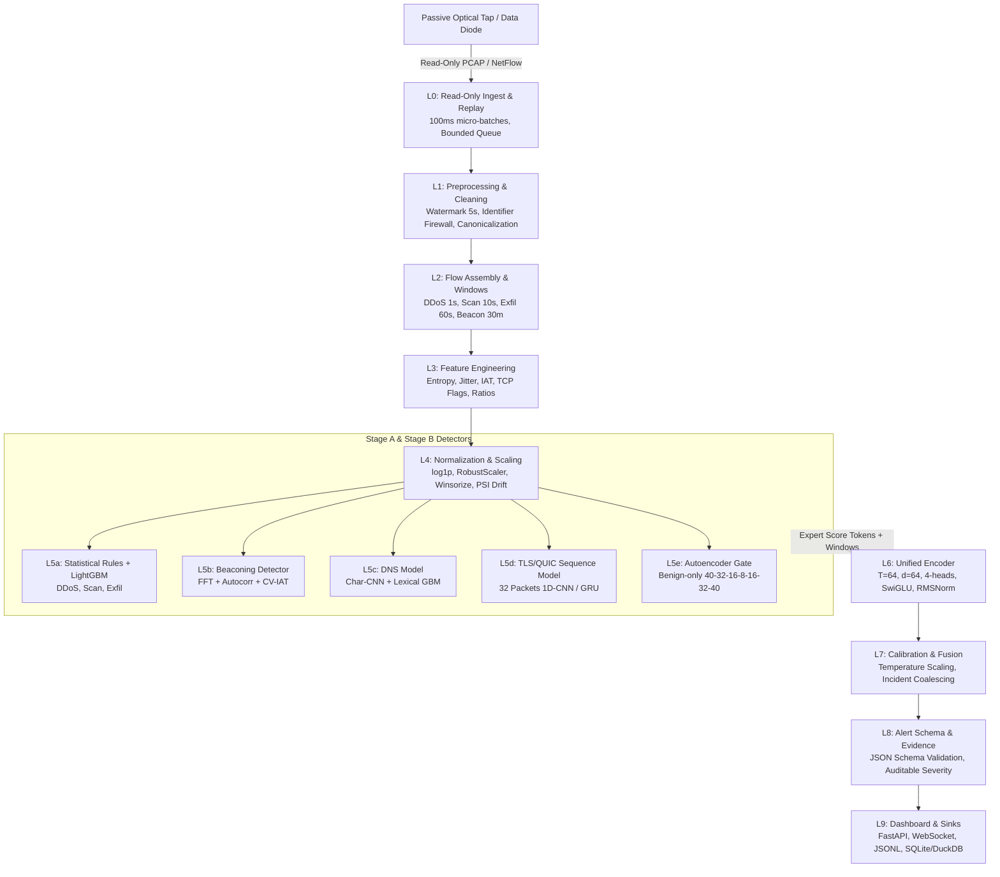

# 🛡️ PassiveSentinel End-to-End Workflow & Pipeline Specification
**Document ID:** PS-SIH145-WF-001  
**Paper Reference:** PassiveSentinel: A Read-Only, Streaming, Multi-Head Threat-Intelligence Pipeline for One-Way Monitored Critical-Infrastructure Links (SIH 2026 PS-145)  
**Standardized Architecture:** Layers L0 to L9, Zero Decryption, Read-Only Optical Diode Ingestion  

---

## 1. System Constraints & Enforcement

| ID | Constraint | Exact Enforcement Mechanism |
|---|---|---|
| **C1** | **Read-only ingest; no return path, live query or inline block** | Ingest binds strictly to read-only interfaces or file captures; no socket connection toward monitored hosts is ever opened. Alerts carry only a human-readable `recommended_action` text string that the system never executes. |
| **C2** | **No payload decryption** | Cleartext TLS/QUIC handshake metadata, directionality, packet sizes, and inter-arrival times only. Payload bytes are never read. QUIC Initial packets are never decrypted. |
| **C3** | **Streaming, not batch** | Event-time sliding windows with a 5-second watermark; 100 ms micro-batches. Alerts emitted as soon as a window closes or an early detector fires. |
| **C4** | **Defined throughput target** | Target $\ge 20,000$ flows/second sustained on a single commodity CPU node; peak memory $\le 4$ GB. |
| **C5** | **Standardized alert schema** | Every incident emitted as a single JSON record validated against [`schema/alert.schema.json`](file:///c:/Users/arpan%20goyal/Desktop/Trinetra/schema/alert.schema.json). |

---

## 2. Layer-by-Layer Architectural Specification (L0 to L9)

### Layer L0: Read-Only Ingest and Replay
- **Purpose:** Ingest one-directional traffic into the enclave without creating any transmission or return path.
- **Inputs:** Pcap files, exported NetFlow/IPFIX records, or live UDP receive-only interface.
- **Outputs:** Stream of raw flow/packet records with ingress timestamp, exporter ID, and sequence counter.
- **Algorithm & Parameters:**
  - Micro-batches of $100\text{ ms}$.
  - In-memory bounded queue with an explicit atomic drop counter (drops recorded, never hidden).
  - Configurable rate replay generator respecting original inter-arrival times.

### Layer L1: Preprocessing, Validation and Cleaning
- **Purpose:** Turn raw, out-of-order, or dirty records into a verified event stream.
- **Inputs:** Micro-batched raw records from L0.
- **Outputs:** Validated, canonical bidirectional flows and DNS/TLS side tables, plus quality counters.
- **Algorithm & Parameters:**
  1. *Schema Validation:* Reject missing mandatory 5-tuple, timestamp, or byte/packet counters.
  2. *Time Normalization:* Convert to UTC epoch milliseconds; keep event-time distinct from processing time.
  3. *De-Duplication:* Key on `(canonical_5_tuple, start_time_bucket, counters)` across multiple exporters.
  4. *Direction Canonicalization:* Merge bidirectional conversations; client = first packet sender.
  5. *Numeric Hygiene:* Replace `NaN` and `+/-inf` with defined sentinel and set `was_missing = 1`; clamp negative counters to zero.
  6. *Late-Event Handling:* Watermark of $5\text{ s}$ allows out-of-order arrival; late arrivals routed to side counter.
  7. *Identifier Firewall:* Raw IPs, ephemeral ports, flow IDs, and absolute timestamps are preserved strictly for window grouping and alert correlation. **They are stripped from all ML inputs.**
  8. *Domain Normalization:* Lowercase, strip trailing dot, punycode decode, split via public suffix list.

### Layer L2: Flow Assembly and Event-Time Sliding Windows
- **Purpose:** Aggregate flows into entity-level and temporal windows for pattern analysis.
- **Inputs:** Clean event stream from L1.
- **Outputs:** Per-entity window objects exposing flow histories, HLL sketches, and count-min sketches.
- **Algorithm & Parameters:**
  - Active timeout: $120\text{ s}$, Idle timeout: $15\text{ s}$.
  - Window lengths:
    - **DDoS:** $1\text{ s}$ per destination IP.
    - **Port Scan:** $10\text{ s}$ per source IP.
    - **Data Exfiltration:** $60\text{ s}$ per internal host IP.
    - **DNS Tunnelling / DGA:** $60\text{ s}$ per `(host, apex_domain)`.
    - **Botnet C2 Beaconing:** Expanding history up to $30\text{ min}$ per `(src, dst, port)` with $\ge 8$ events.
  - Window hop: $1/4$ of window length ($75\%$ overlap) to prevent boundary misses. State expires with TTL.

### Layer L3: Feature Engineering
- **Purpose:** Passively extract scale-free, behavioral descriptors for all 6 threat families + benign.
- **Inputs:** Per-flow records and entity windows from L2.
- **Outputs:** Fixed-order float vector per flow ($\sim 40$ features) and per entity window (defined in [`configs/features.yaml`](file:///c:/Users/arpan%20goyal/Desktop/Trinetra/configs/features.yaml)).
- **Core Formulations:**
  - Normalized Shannon Entropy: $H_{\text{norm}}(X) = -\frac{\sum_i p_i \log_2 p_i}{\log_2 N}$
  - Inter-Arrival Jitter: $\text{CV}(IAT) = \frac{\sigma(dt)}{\mu(dt) + \epsilon}$
  - Traffic Asymmetry: $\text{ratio\_io} = \log\left(\frac{\text{bytes\_out} + 1}{\text{bytes\_in} + 1}\right)$

### Layer L4: Normalization and Encoding
- **Purpose:** Rescale heterogeneous distributions on stable scales while preventing train-to-test leakage.
- **Inputs:** Raw extracted feature vectors from L3.
- **Outputs:** Normalized `float32` tensors + frozen scaler artifact + PSI drift metrics.
- **Algorithm & Rules:**
  1. Heavy-tail transform: $\log(1 + x)$ on counts, bytes, durations, rates.
  2. Robust scaling: $x' = \frac{x - \text{median}}{\text{IQR}}$ fitted strictly on **benign training data**.
  3. Winsorization: Clip to $[0.1\text{th}, 99.9\text{th}]$ percentiles of training set.
  4. Bounded features ($[0, 1]$ ratios, entropy) left unscaled.
  5. Categoricals: One-hot for protocol/port class; frequency-capped embedding for TLS hashes (count $< 5 \to \text{UNKNOWN}$).
  6. Packet sequences: Size divided by MTU with sign for direction, $\log(1 + IAT)$ in ms, padded to $T=32$.
  7. Missing flags from L1 retained as binary inputs.
  8. Drift monitor: Population Stability Index (PSI) over 10 quantile bins; trigger alert if $\text{PSI} > 0.25$.

### Layer L5: Specialist Detectors
- **L5a (Statistical DDoS / Scan / Exfil):**
  - EWMA baseline with CUSUM change detector on pps, new-flow rate, and source entropy.
  - Rule-gated LightGBM/XGBoost ($300$ trees, depth $6$, $\text{lr}=0.05$, subsample $0.8$).
- **L5b (Botnet C2 Beaconing):**
  - Discrete Fourier Transform (FFT) + autocorrelation over binned start times.
  - Features: dominant FFT frequency, spectral power share, autocorrelation peak, $\text{CV}(IAT)$.
  - Small LightGBM model trained with timing jitter data augmentation (up to $20\%$).
- **L5c (DNS DGA & Tunnelling):**
  - Character-level 1D-CNN (embedding $32$, conv widths $3/4/5$ with $64$ filters, global max-pool, dense $64$, dropout $0.2$).
  - Lexical-behavioral LightGBM using entropy, n-gram log-likelihood, length, NXDOMAIN ratio.
- **L5d (TLS/QUIC Sequence Model):**
  - Input: First $32$ packets as `(signed_size/MTU, log1p_iat, direction)` plus handshake fields.
  - 1D-CNN ($3$ blocks, $64$ channels) or GRU($64$) + fingerprint embedding ($16$).
- **L5e (Autoencoder Gate for Unknown Threats):**
  - Dense Autoencoder ($40 \to 32 \to 16 \to 8 \to 16 \to 32 \to 40$), ReLU activations, trained on benign data only with MSE loss.
  - Anomaly threshold = $99.5\text{th}$ percentile of benign validation reconstruction error.

### Layer L6: Unified Encoder with Typed Heads (Jev-Inspired)
- **Purpose:** Cross-detector multi-task fusion reasoning over entity windows.
- **Inputs:** Sequence of $T=64$ tokens: up to $63$ recent flow tokens (L4 normalized) + $1$ expert-score token packing L5a..L5e outputs.
- **Architecture:**
  - Token embedding + continuous-time encoding of $\log(\text{IAT})$.
  - $N=2$ bidirectional self-attention encoder layers (no causal mask), $d_{\text{model}}=64$, $4$ heads, $d_{\text{ff}}=256$ (SwiGLU), RMSNorm, dropout $0.1$.
  - Parallel cross-attention query pooling with typed question embeddings.
  - Typed Heads:
    1. **Boolean Head:** $\sigma(z) \in [0, 1]$ for `is_malicious`, `is_spoofed_source`, `is_periodic`, `is_encrypted_threat`.
    2. **Choice Head:** $\text{Softmax}(z) \in \mathbb{R}^7$ over `{benign, ddos, beaconing, dga_tunnel, encrypted_malware, recon_scan, exfiltration}`.
    3. **Score Head:** Expectation over $K=11$ bins $\in [0, 10]$ for severity.
- **Loss Function:**
  $$\mathcal{L} = \mathcal{L}_{\text{choice}} + 0.5 \cdot \mathcal{L}_{\text{boolean}} + 0.2 \cdot \mathcal{L}_{\text{score}}$$
  with Focal loss ($\gamma=2$) on choice, class weights for rare attacks, and $0.05$ label smoothing.

### Layer L7: Calibration and Evidence-Aware Fusion
- **Purpose:** Ensure emitted probabilities match real empirical frequencies and resolve conflicting detector signals.
- **Algorithm:**
  - Post-hoc Temperature Scaling: Logits divided by validation-fitted temperature $T$ to minimize NLL; evaluated via $15$-bin ECE.
  - Conflict Resolution: If an interpretable specialist (L5a..L5d) strongly fires above its threshold and disagrees with L6, the alert retains the L6 class but flags the dissent in evidence and caps confidence at the lower value.
  - Incident Coalescing: Successive alerts for the same entity and class within a merge window are coalesced into a single incident with `first_seen` and `last_seen`.

### Layer L8: Standard Alert Schema, Severity and Evidence
- **Purpose:** Emit structured, machine-actionable incident records.
- **Deterministic Severity Formula:**
  $$\text{severity} = 10 \cdot (0.5 \cdot \text{confidence} + 0.3 \cdot \text{impact} + 0.2 \cdot \text{persistence})$$
  $$\text{impact} = \min\left(1, \frac{\log_{10}(1 + \text{volume})}{\log_{10}(1 + V_{\text{ref}})}\right)$$
- **Evidence Formatting:** Top-$k$ deviating features ranked by robust z-score, plus specialist facts (ports, domains, fingerprints, FFT periods).

### Layer L9: Streaming Dashboard & Forensic Sinks
- **Purpose:** Low-latency analyst triage and audit.
- **Components:** FastAPI server, WebSocket live alert stream, rotating JSON-lines sink, and DuckDB/SQLite audit store.

---

## 3. Data Requirements & Ingest Matrix

| Threat Family (Class) | Passive Signatures Needed | Primary Source Dataset | Coverage Status | Fallback / Synthetic Plan |
|---|---|---|---|---|
| **BENIGN** | Normal browsing, balanced byte ratios, human IAT variance | `data/processed/train.csv`, `NF-UNSW-NB15-v3.csv`, `NF-CICIDS2018-v3.csv` | Full (14,000+ flows) | Real NetFlow background |
| **VOLUMETRIC_PROTOCOL_DDOS** | Extreme pps/bps, SYN-without-ACK, low IAT, small packets | `NF-BoT-IoT-v3.csv`, `NF-CICIDS2018-v3.csv` | Full (millions of flows) | Fully covered |
| **BOTNET_C2_BEACONING** | Strict periodic start times, low CV(IAT), fixed byte counts | `NF-BoT-IoT-v3.csv`, CTU-13 flows | Full (3,600+ baseline + NF) | Timing-jitter augmentation |
| **DNS_TUNNEL_DGA** | High Shannon entropy, long query length, high digit ratio | `data/raw/dga_domains_sample.csv`, Trinetra baseline | Full (8,400+ flows) | Public DGA dictionary |
| **MALWARE_ENCRYPTED** | TLS handshake fields, bimodal size sequence, JA3/JA4 | `NF-CICIDS2018-v3.csv`, `NF-UNSW-NB15-v3.csv` | Full (3,500+ flows) | Cleartext handshake metadata |
| **RECON_PORTSCAN** | Fan-out ratio, RST/ICMP ratio, single-packet sweeps | `NF-ToN-IoT-v3.csv`, `NF-UNSW-NB15-v3.csv` | Full (6,500+ baseline + NF) | Fully covered |
| **DATA_EXFILTRATION** | Outbound/inbound ratio > 0.95, burst-vs-sustained, EWMA deviation | `data/processed/*.csv`, `NF-ToN-IoT-v3.csv` | Full (3,600+ baseline + NF) | Documented asymmetric injection |

---

## 4. Evaluation Protocol & Targets

### Key Performance Targets (Table 6.4)
- **Macro-F1 (In-Distribution Test):** $\ge 0.95$
- **Per-Class F1 (DDoS, Scan):** $\ge 0.95$
- **Per-Class F1 (Beaconing, DGA):** $\ge 0.90$
- **Per-Class F1 (Encrypted Malware, Exfil):** $\ge 0.85$
- **Cross-Dataset Generalization Macro-F1:** $\ge 0.75$
- **Calibration Error (ECE, 15 bins):** $\le 0.05$
- **Sustained Flow Rate:** $\ge 20,000\text{ flows/s}$ on CPU
- **Alert Latency ($p95$):** $\le 1.0\text{ s}$ after window close
- **Peak Memory:** $\le 4\text{ GB}$

### Ablation Suite (A0 to A10)
- **A0:** Rules / statistical only (L5a, L5b)
- **A1:** A0 + specialist ML (L5c, L5d)
- **A2:** A1 + autoencoder gate (L5e)
- **A3:** A2 + unified encoder (L6) + calibration (L7) [Full Proposed Architecture]
- **A4:** A3 without expert-score token (evaluates L6 independent learning)
- **A5:** A3 with plain MLP head instead of attention encoder
- **A6:** A3 without robust scaling / $\log(1+p)$ (evaluates L4 normalization)
- **A7:** A3 with identifier leakage allowed (IPs, ports, timestamps) to quantify artificial inflation
- **A8:** A3 without JA3/JA4 fingerprint features (evaluates fingerprint dependency)
- **A9:** A3 without temperature scaling (evaluates calibration gain)
- **A10:** Single-head (choice only) versus multi-head training (evaluates typed-head regularization)

---

## 5. Paper Ambiguities & Explicit Engineering Decisions

| Item | Ambiguity in Paper | Concrete Engineering Decision | Rationale |
|---|---|---|---|
| **1. NetFlow vs Full Packet Sequences** | Paper mentions first 32 packet sizes/IATs for L5d, but NetFlow v3 exports flow summaries (e.g. `NUM_PKTS_UP_TO_128_BYTES`, IAT stats). | When reading pure NetFlow records without raw PCAPs, synthesize the 32-packet sequence vector using the flow's packet length histogram and mean/std IAT. When PCAPs are provided, extract exact per-packet headers. | Preserves L5d model input shape ($32 \times 3$) and model weights across both NetFlow and PCAP ingestion modes. |
| **2. Volume Reference $V_{\text{ref}}$ in Severity** | Paper defines $\text{impact} = \min\left(1, \frac{\log_{10}(1+\text{volume})}{\log_{10}(1+V_{\text{ref}})}\right)$ but does not specify numerical $V_{\text{ref}}$. | Set $V_{\text{ref}} = 10^7\text{ bytes}$ ($10\text{ MB}$). | For flow windows, $10\text{ MB}$ represents an extreme burst for single sessions, properly scaling impact between $0.0$ and $1.0$. |
| **3. Continuous-Time Encoding Formula** | Paper states "continuous-time encoding of log inter-arrival time (a stand-in for positional encoding)". | Use sinusoidal Fourier positional embeddings applied to $\log(1 + \Delta t)$: $\text{PE}_{2i}(\Delta t) = \sin\left(\frac{\log(1+\Delta t)}{10000^{2i/d}}\right)$, $\text{PE}_{2i+1}(\Delta t) = \cos\left(\frac{\log(1+\Delta t)}{10000^{2i/d}}\right)$. | Standard, numerically stable temporal attention encoding preserving scale invariance. |
| **4. Multiprocessing on Windows** | Paper mentions POSIX-style multiprocessing with queues. Windows defaults to `spawn` (not `fork`). | Wrap all worker initialization in `if __name__ == '__main__':` guards, serialize configs via JSON/dict, and avoid shared global state. | Guarantees bug-free concurrent process execution on Windows OS. |
| **5. XGBoost vs LightGBM** | Paper lists "XGBoost or LightGBM" for L5a/L5b. | Use **LightGBM** as the primary tree engine. | LightGBM is already verified and installed in Python 3.12, is faster, and natively handles categorical features with lower memory consumption. |
